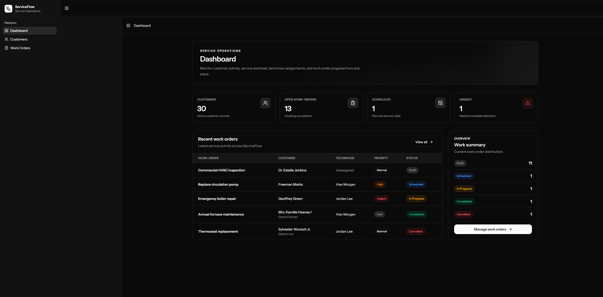
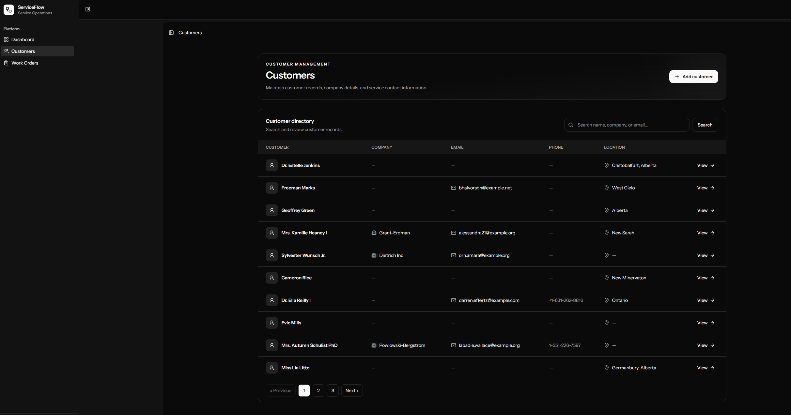
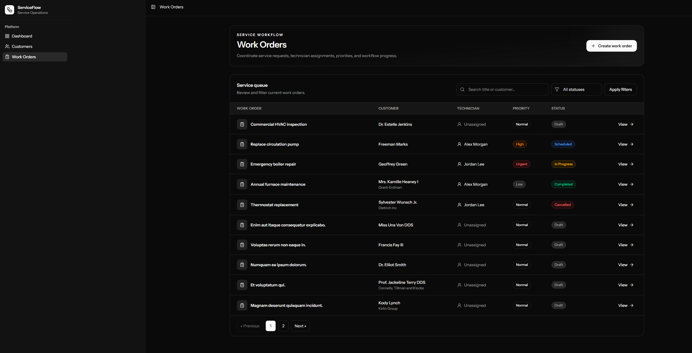
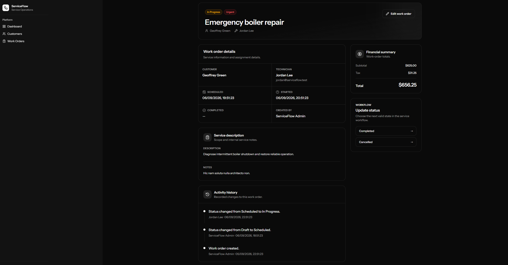

# ServiceFlow

ServiceFlow is a full-stack service operations platform for managing customers, work orders, technician assignments, workflow status, pricing, and audit history.

It was built as a production-style Laravel and Vue application with a focus on maintainable architecture, authorization, validation, testing, CI/CD, and deployment.

## Live Demo

**Application:**  
https://serviceflow-laravel-vue-production.up.railway.app

### Demo Account

```text
Email: admin@serviceflow.test
Password: password
```

The demo environment contains seeded customers, technicians, work orders, and activity history so the application can be explored immediately.

> This account is for portfolio demonstration purposes only.

## Dashboard



`docs/screenshots/dashboard.png`

The dashboard provides an operational overview of ServiceFlow, including:

- customer count
- open work orders
- scheduled service
- urgent work
- recent work-order activity
- work-order status distribution

## Features

### Customer Management

ServiceFlow provides customer management for service-based businesses.

Features include:

- create customer records
- update customer information
- company and contact details
- service address information
- internal customer notes
- search by name, company, or email
- server-side pagination
- backend authorization



`docs/screenshots/customers.png`

### Work Order Management

Work orders represent service jobs associated with customers.

Features include:

- create and update work orders
- assign technicians
- associate work orders with customers
- schedule service jobs
- manage work-order priority
- record subtotal and tax
- calculate totals server-side
- search work orders
- filter by workflow status
- server-side pagination



`docs/screenshots/work-orders.png`

### Work Order Workflow

ServiceFlow uses an explicit workflow state machine rather than allowing arbitrary status changes.

```text
Draft
 ├── Scheduled
 └── Cancelled

Scheduled
 ├── In Progress
 └── Cancelled

In Progress
 ├── Completed
 └── Cancelled

Completed
 └── Terminal

Cancelled
 └── Terminal
```

Invalid transitions are rejected by the domain layer.

Workflow timestamps are managed automatically:

- transitioning to `In Progress` records `started_at`
- transitioning to `Completed` records `completed_at`

### Work Order Activity History

Important work-order actions are recorded in an audit trail.

The activity history tracks:

- work-order creation
- work-order updates
- status transitions
- previous workflow state
- new workflow state
- user responsible for the action
- timestamp



`docs/screenshots/work-order-detail.png`

## Role-Based Authorization

ServiceFlow currently supports two roles.

### Admin

Admins can:

- view all customers
- create customers
- update customers
- view all work orders
- create work orders
- update work orders
- assign technicians
- perform valid work-order transitions

### Technician

Technicians can:

- view their assigned work orders
- view customer information required for assigned work
- perform valid workflow transitions on their assigned work orders

Authorization is enforced on the backend with Laravel policies rather than relying only on frontend visibility.

## Technology Stack

### Backend

- PHP 8.4+
- Laravel 13
- MySQL 8
- Eloquent ORM
- Laravel Policies
- Form Requests
- Service classes
- Pest

### Frontend

- Vue 3
- TypeScript
- Inertia.js
- Tailwind CSS
- Lucide icons
- Vite

### Engineering and Quality

- PHPStan
- Larastan
- Laravel Pint
- Vue TypeScript checking
- frontend formatting and linting
- GitHub Actions
- Railway deployment

## Architecture

ServiceFlow follows a layered Laravel architecture while avoiding unnecessary abstractions.

```text
HTTP Request
    │
    ▼
Controller
    │
    ├── Authorization Policy
    ├── Form Request Validation
    │
    ▼
Application / Domain Service
    │
    ▼
Eloquent Model
    │
    ▼
MySQL
```

Controllers coordinate HTTP requests and responses.

Validation is handled through dedicated Laravel Form Requests.

Authorization is enforced through policies.

Business rules that contain meaningful domain behavior are moved into services.

For example, work-order status transitions are handled by `WorkOrderStatusService` rather than placing transition logic directly inside controllers.

## Key Design Decisions

### Domain Services for Business Rules

Workflow rules are implemented in dedicated service classes.

This keeps controllers focused on HTTP concerns while making business behavior easier to test independently.

### Laravel Policies for Authorization

Customer and work-order permissions are enforced through Laravel policies.

This keeps authorization logic centralized and ensures the backend remains the source of truth.

### No Repository Layer

ServiceFlow intentionally uses Eloquent directly instead of introducing a repository abstraction.

For the current application size, an additional repository layer would add unnecessary complexity without providing meaningful separation.

### Server-Side Totals

Work-order totals are calculated on the backend from subtotal and tax.

The application does not trust a client-provided total.

### Audit History

Important work-order changes are persisted as activity records.

This provides traceability and makes it possible to understand how a service job moved through its workflow.

### No Hard Delete

Customer and work-order deletion were intentionally excluded from the MVP.

Operational records can have historical value, and destructive behavior would require a more deliberate archival or soft-delete strategy.

## Core Domain Model

```text
User
 ├── Role
 └── Work Order Assignments

Customer
 └── Work Orders

Work Order
 ├── Customer
 ├── Assigned Technician
 ├── Creator
 └── Activities

Work Order Activity
 ├── User
 ├── Previous Status
 └── New Status
```

## Testing

ServiceFlow includes automated tests for core application behavior.

Coverage includes:

- customer authorization
- customer creation
- customer updates
- customer search
- customer pagination
- admin work-order transitions
- technician work-order transitions
- unauthorized technician access
- valid workflow transitions
- invalid workflow transitions
- automatic start timestamps
- automatic completion timestamps
- work-order creation activity
- work-order update activity
- status transition activity

Run the complete project quality suite with:

```bash
composer run ci:check
```

The command verifies:

```text
Frontend formatting
Frontend linting
Vue TypeScript types
Laravel configuration
Laravel Pint formatting
PHPStan / Larastan static analysis
Automated tests
```

## Continuous Integration

GitHub Actions verifies application quality before changes are merged.

The CI pipeline includes:

- PHP dependency installation
- Node dependency installation
- MySQL service setup
- environment preparation
- database migrations
- Wayfinder generation
- production frontend build
- frontend checks
- PHP formatting checks
- static analysis
- automated tests

## Local Development

### Requirements

Install the following before running ServiceFlow locally:

- PHP 8.4+
- Composer
- Node.js
- npm
- MySQL 8

### Clone the Repository

```bash
git clone https://github.com/hmasonxD/serviceflow-laravel-vue.git
cd serviceflow-laravel-vue
```

### Install PHP Dependencies

```bash
composer install
```

### Install Frontend Dependencies

```bash
npm install
```

### Create Environment File

On macOS or Linux:

```bash
cp .env.example .env
```

On Windows PowerShell:

```powershell
Copy-Item .env.example .env
```

### Generate Application Key

```bash
php artisan key:generate
```

### Configure MySQL

Update the database values in `.env`.

```env
DB_CONNECTION=mysql
DB_HOST=127.0.0.1
DB_PORT=3306
DB_DATABASE=serviceflow_dev
DB_USERNAME=your_username
DB_PASSWORD=your_password
```

Create the database before running migrations.

### Run Migrations and Seed Demo Data

```bash
php artisan migrate --seed
```

### Start the Application

Run Laravel:

```bash
php artisan serve
```

In another terminal, run Vite:

```bash
npm run dev
```

The Laravel application will normally be available at:

```text
http://localhost:8000
```

## Production Build

Build the frontend for production with:

```bash
npm run build
```

Run the complete quality suite with:

```bash
composer run ci:check
```

## Deployment

ServiceFlow is deployed on Railway.

Production infrastructure:

```text
Railway
 ├── Laravel / Vue application
 └── MySQL 8 database
```

The Laravel application uses Railway environment variables for production configuration and MySQL connectivity.

Database migrations are executed during Railway's pre-deployment phase with:

```bash
php artisan migrate --force
```

Frontend assets are compiled during the Railway build process using Vite.

The application is configured to trust Railway's reverse proxy so HTTPS asset URLs are generated correctly in production.

## Environment Configuration

Important production environment variables include:

```text
APP_NAME
APP_ENV
APP_DEBUG
APP_KEY
APP_URL

DB_CONNECTION
DB_HOST
DB_PORT
DB_DATABASE
DB_USERNAME
DB_PASSWORD

SESSION_DRIVER
CACHE_STORE
QUEUE_CONNECTION
MAIL_MAILER
```

Secrets such as `APP_KEY` and database credentials are stored in Railway environment variables and are not committed to the repository.

## Project Scope

ServiceFlow is intentionally focused on a well-built service-management core.

Current functionality includes:

- authentication
- email verification
- role-based authorization
- customer management
- customer search
- work-order management
- technician assignment
- work-order priorities
- workflow state management
- automatic workflow timestamps
- pricing
- activity history
- dashboard reporting
- responsive light and dark themes
- automated testing
- static analysis
- CI/CD
- production deployment

Features intentionally kept outside the MVP include:

- invoicing
- payment processing
- file uploads
- SMS notifications
- multi-tenancy
- calendar integrations
- AI features

The goal was to build a focused application with strong engineering fundamentals rather than adding features without sufficient depth.

## Screenshots

### Dashboard


`docs/screenshots/dashboard.png`

### Customers


`docs/screenshots/customers.png`

### Work Orders


`docs/screenshots/work-orders.png`

### Work Order Workflow and Activity History


`docs/screenshots/work-order-detail.png`

## Repository

GitHub:  
https://github.com/hmasonxD/serviceflow-laravel-vue

## Author

**Hamza Mhamdi**

Full-stack software developer focused on building maintainable web applications with modern backend and frontend technologies.
